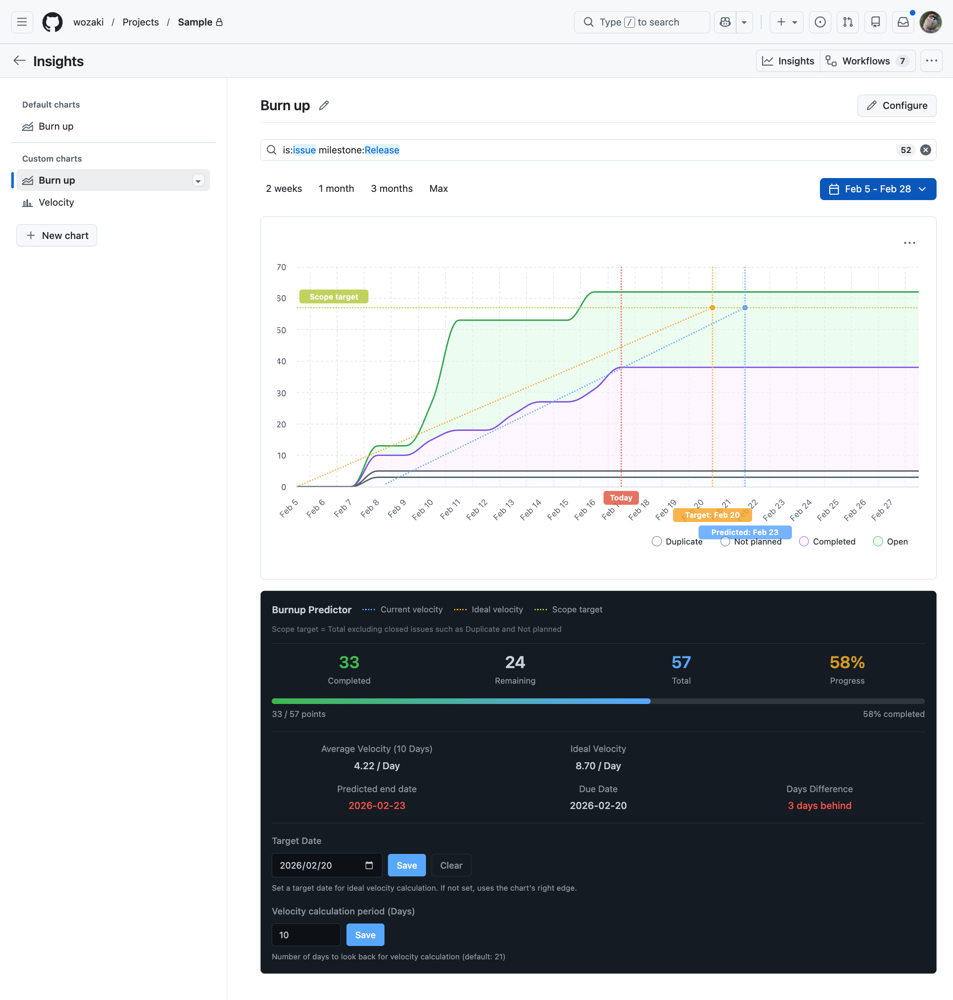
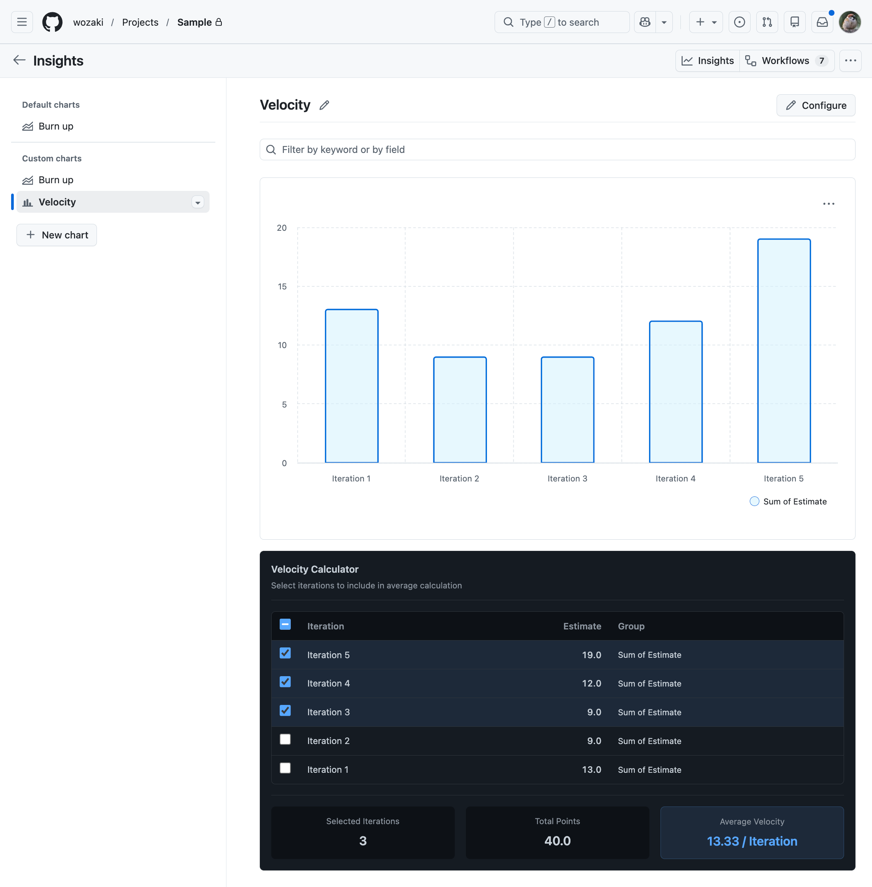

# Insights Plus for GitHub Projects

[日本語](README.ja.md)

  [](https://chromewebstore.google.com/detail/insights-plus-for-github/eeadfjedbkhpjbccolcfbhflfckmfcmj?utm_source=github&utm_medium=readme&utm_campaign=badge) [](LICENSE) [](https://deepwiki.com/wozaki/insights-plus-for-github-projects)

A Chrome extension that enhances GitHub Projects with insights like velocity prediction, completion date estimation, and more.

## Installation

Install from Chrome Web Store (Recommended)

<a href="https://chromewebstore.google.com/detail/insights-plus-for-github/eeadfjedbkhpjbccolcfbhflfckmfcmj?utm_source=github&utm_medium=readme&utm_campaign=install_button">
  
</a>

<details>
<summary>Other installation methods</summary>

### Install from Release

1. Go to the [Releases](https://github.com/wozaki/insights-plus-for-github-projects/releases) page
2. Download the latest `.zip` file
3. Extract the zip file
4. Open `chrome://extensions/` in Chrome
5. Enable "Developer mode" in the top right
6. Click "Load unpacked extension"
7. Select the extracted folder

### Install in Developer Mode

1. Clone or download this repository
2. Install dependencies: `pnpm install`
3. Run development mode: `pnpm run dev`
4. Chrome will open automatically with the extension loaded

### Install from Production Build

1. Run `pnpm run build`
2. Open `chrome://extensions/` in Chrome
3. Enable "Developer mode" in the top right
4. Click "Load unpacked extension"
5. Select the `.output/chrome-mv3` folder

</details>

## Features

### 1. Burn-up Chart Enhancement

Extends GitHub Projects' burn-up chart with velocity analysis and completion prediction.

- 📈 **Current Velocity Display**: Displays the current velocity slope calculated from past data as a dashed line
- 🎯 **Ideal Velocity Display**: Displays the ideal velocity required to complete by the deadline as a solid line
- 📅 **Completion Prediction Date**: Displays the predicted completion date if the current velocity is maintained
- 📊 **Statistics Panel**: Displays total estimate, completed estimate, and completion percentage



### 2. Average Velocity Calculation across Multiple Iterations

Calculates and displays the average velocity across multiple iterations in bar/column charts.



### 3. Date Field Alerts (List View)

Adds small, in-cell hints to Date custom fields in the **list view** — without adding new columns — to surface missing dates, long-running work, and overdue items.

- ⚠️ **Missing Start / End**: flags in-progress items with no start date, in-progress items with no end date, and done items with no end date
- ⏱️ **Age**: shows how many days an in-progress item has been running, color-coded (normal / caution / warning)
- 🔴 **Overdue**: flags not-done items past their end date

## Usage

### 1. Burn-up Chart Enhancement

#### GitHub Insights Configuration

Configure your chart with the following settings:

| Setting | Value |
|---------|-------|
| Layout | Stacked area |
| X-axis | Time |
| Y-axis | Count of items or Sum of field (Recommended: Sum of field with a Number field for Story points) |
| Date range | Custom range (Recommended: from observation start date to release target date + 1 month) |

#### How to Use

1. Open the GitHub Project Insights page (`/insights`)
2. When the burn-up chart is displayed, the extension will automatically activate
3. A statistics panel will appear below the chart
4. Velocity prediction lines will be overlaid on the chart

The deadline is automatically obtained from the end point of the graph's X-axis.

### 2. Average Velocity Calculation

#### GitHub Insights Configuration

Configure your chart with the following settings:

| Setting | Value |
|---------|-------|
| Layout | Bar, Column, Stacked bar, or Stacked column |
| X-axis | Custom field with Iteration field type |
| Y-axis | Count of items or Sum of field (Recommended: Sum of field with a Number field for Story points) |

#### How to Use

1. Open the GitHub Project Insights page (`/insights`)
2. When a bar/column chart with Iteration on X-axis is displayed, the extension will automatically calculate the average velocity
3. The average velocity will be displayed on the chart

### 3. Date Field Alerts

#### How to Use

1. Open a GitHub Project **list (table) view** (`/views/...`)
2. A settings bar appears at the top of the list. Click **Configure**, map your **Start** and **End** date fields (likely matches are pre-selected from your Date fields), and click **Save**
3. Alerts appear inline next to the dates in the Start/End columns, and update as you scroll

By default (before you ever open **Configure**), whether an item counts as "in progress" or "done" is guessed from its Status option name (e.g. "In Progress", "Review", "Done"). If your Status column uses different wording, or has enough options (~10) that guessing gets unreliable, open **Configure** and set the optional **In Progress statuses** / **Done statuses** pickers — both are pre-filled with the current guess, so you only need to adjust what's wrong. Once you save, the picker's contents take full control — a status left out of both is treated as unclassified and gets no alerts at all, even if it would otherwise keyword-match. This also applies if you save with both pickers empty (e.g. via the **Clear** link, useful since a plain `<select multiple>` has no built-in way to deselect everything at once): that turns status-based alerts off entirely rather than reverting to the automatic guess.

#### Alert rules

| Status | Condition | Shown |
|--------|-----------|-------|
| In Progress | No start date | Start: `⚠ Missing` |
| In Progress | Has a past start date | Start: `Age Nd` (color-coded: 0–5 normal, 6–10 caution, 11+ warning) |
| Todo or In Progress | End date is in the past | End: `Overdue Nd` |
| In Progress | No end date | End: `⚠ Missing` |
| Done | No end date | End: `⚠ Missing` |

Notes:

- The Start/End field mapping (and the optional status pickers) are stored per project (via `chrome.storage.local`), so field renames don't break it (field/status IDs are used internally).
- Alerts are computed from the items loaded on the page and refresh on reload; edits made after load are reflected after refreshing.

## Development

### Install Dependencies

```bash
pnpm install
```

### Development (with HMR)

Start the development server with Hot Module Replacement:

```bash
pnpm run dev
```

This will:
- Start a dev server at `http://localhost:3000`
- Automatically open Chrome with the extension loaded
- **Auto-reload the extension when you make changes**

For Firefox development:

```bash
pnpm run dev:firefox
```

#### Customizing Development Environment

You can customize the browser behavior when starting the development server. Create a `.env.local` file in the project root and configure the following environment variables:

1. Copy the example file:
   ```bash
   cp env.example .env.local
   ```

2. Edit `.env.local` and set the following variables:

The `.env.local` file is included in `.gitignore` and will not be committed to Git. Refer to the `env.example` file as a template.

### Build for Production

```bash
pnpm run build
```

For Firefox:

```bash
pnpm run build:firefox
```

### Create Distribution Package

```bash
pnpm wxt zip
```

### Release

To create a new release, run the **Bump Version** workflow from the [Actions tab](../../actions/workflows/bump-version.yml) (or `gh workflow run bump-version.yml -f version=1.2.3`), entering the new version number.

This will automatically:
- Update the `version` field in `package.json` and commit it to `main`
- Trigger the **Release** workflow, which:
  - Creates a git tag (e.g., `v1.2.3`)
  - Builds the extension
  - Creates a GitHub Release with the built `.zip` file
  - Submits the build to the Chrome Web Store

If the tag already exists, the release workflow will skip the release.

<details>
<summary>Manual alternative</summary>

You can also trigger a release by pushing the version bump yourself:

1. Update the `version` field in `package.json`
2. Commit and push to the `main` branch

This triggers the same Release workflow.

</details>


### Tech Stack

- [WXT](https://wxt.dev/) - Next-gen Web Extension Framework
- TypeScript
- Vite (via WXT)
